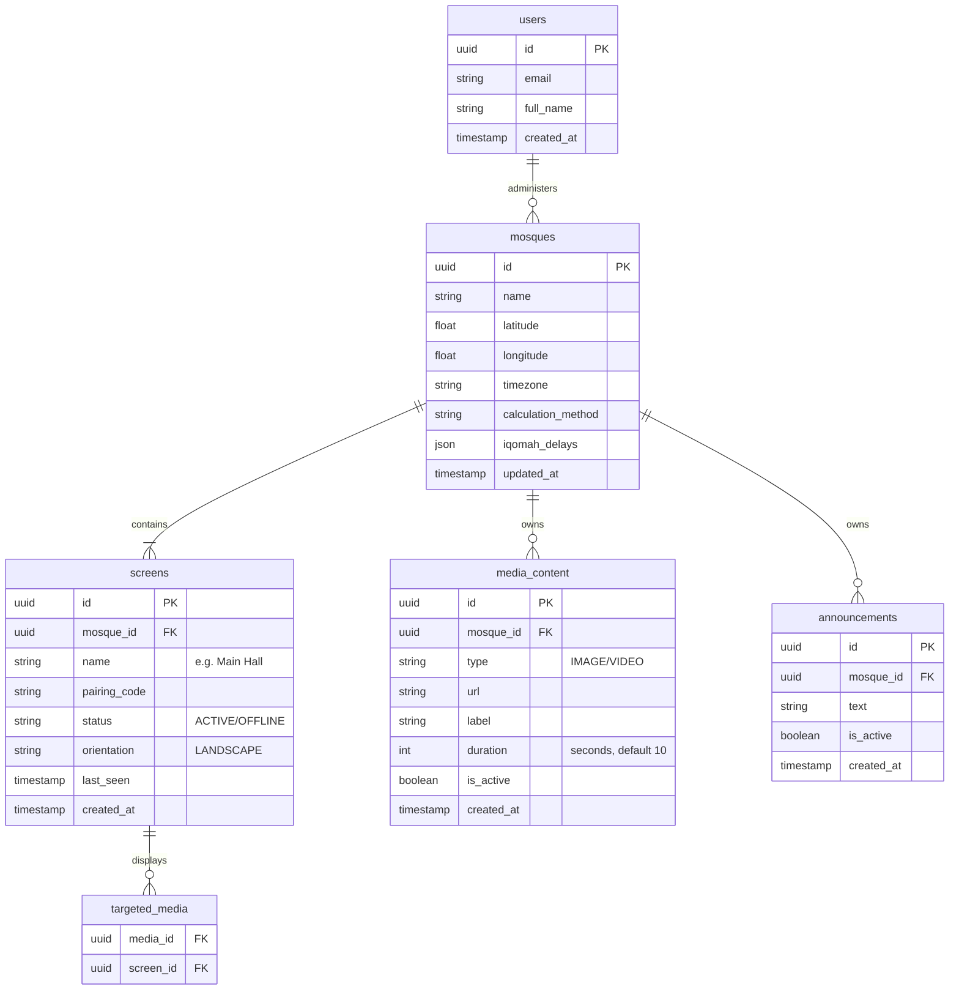

# Core ERD (Jadzan)

| Metadata      | Details |
| :---          | :--- |
| **System**    | Jadzan Database Schema |
| **Version**   | 1.0.0 (Global ERD) |
| **Status**    | Approved |

---

## Entity Relationship Diagram

## Relationships

*   **1 User -> Many Mosques**: Allows a Super Admin or Mosque Manager to oversee multiple locations (e.g., Main Branch + Satellite).
*   **1 Mosque -> Many Screens**: A large mosque might have a Men's Hall, Women's Hall, and Lobby screen.
*   **1 Mosque -> Many Media**: Content is uploaded *to the Mosque's library*, then assigned to screens.
*   **Media <-> Screens**: A Many-to-Many relationship (via `targeted_media` junction table if needed, or array in `media_content` for simplicity). The diagram shows `targeted_media` for normalized flexibility.
