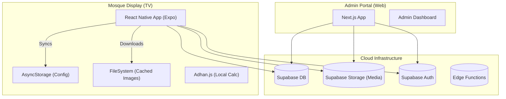

# Technology Stack & Architecture

| Category | Choice | Reasoning |
| :--- | :--- | :--- |
| **Mobile Strategy** | React Native (Expo) | Cross-platform (Android TV target), shared JS/TS codebase, rapid iteration, easy OTA updates (if needed). |
| **Frontend Framework** | Next.js 14 (App Router) | React Server Components for heavy lifting, SEO friendly (for admin/marketing), robust routing. |
| **Styling** | Tailwind CSS + Shadcn/ui | Accelerated UI development, consistent theme, accessible components. |
| **Backend / DB** | Supabase (PostgreSQL) | Relational schema (Mosques -> Screens), Realtime subscriptions for instant updates, built-in Auth & Storage. |
| **State Management** | Zustand | Lightweight, simple global state for app settings (e.g., cached prayer times). |
| **Form Handling** | React Hook Form + Zod | Type-safe form validation for complex admin inputs (Iqomah config). |
| **Query/Fetching** | TanStack Query (React Query) | Efficient data fetching, caching, and synchronization (critical for offline-first). |
| **Deployment (Web)** | Vercel | Zero-config deployment for Next.js, edge functions. |
| **Deployment (TV)** | EAS Build / APK | Direct APK generation for sideloading onto Android TV boxes. |

---

## 1. Architecture Overview

### High-Level Diagram

### Key Decisions
1.  **Offline-First**: The TV app *must* cache configuration and media locally. It will poll the DB for changes but operate independently if offline.
2.  **Edge Functions**: Use for complex server-side logic (e.g., generating daily prayer schedules if calculation is heavy, though `adhan.js` is light enough for client-side).
3.  **Realtime**: Use Supabase Refection to trigger immediate updates on the TV when Admin saves changes (e.g., "Park car 1234" alert).

## 2. Component Breakdown

### 2.1 Backend (Supabase)
*   **Database**: PostgreSQL.
*   **Auth**: Email/Password for Admins, Anonymous/Device Token for TVs.
*   **Storage**: Buckets for `media_uploads` (Images/Videos).
*   **RLS Policies**: Strict rules ensuring Admins can only edit *their* Mosque's data; TVs can only read *their* assigned screen data.

### 2.2 Frontend (Next.js Admin)
*   **Pages**: `/login`, `/dashboard`, `/mosques/[id]/screens`, `/mosques/[id]/media`.
*   **Features**: Drag-and-drop media upload, live preview of ticker.

### 2.3 Mobile (Expo TV App)
*   **Screens**: `PairingScreen`, `MainDisplay`.
*   **Services**: `PrayerService` (calculates times), `SyncService` (downloads media), `KeepAwake` (prevents sleep).
*   **Navigation**: React Navigation (Stack).

## 3. Development Tools
*   **Package Manager**: `bun` (fast installs, built-in bundler).
*   **Linting**: `eslint`, `prettier`.
*   **Git Hooks**: `husky` (pre-commit checks).
*   **VS Code Extensions**: `Tailwind CSS IntelliSense`, `ES7+ React/Redux/React-Native snippets`.
